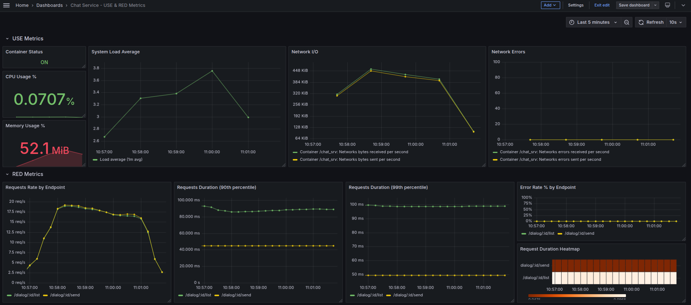

# Сервис социальной сети (курс Highload Architect)

## ДЗ 11: Мониторинг

### Описание

По постановке ДЗ, требуется развернуть систему мониторинга сервиса чатов в нашей распределенной микросервисной архитектуре.

Вся система разворачивается одним docker compose файлом. Нас же по постановке ДЗ будет интересовать именно сервис чатов/диалогов.  
Ранее в ДЗ 7 он был у нас реализован в монолитном приложении с применением In-Memory СУБД (работа с UDF), что позволило получить некий сквозной кеш между приложением и PostgreSQL, что дало значительный прирост в пропускной способности (добавилась асинхронность), и позволило вынести часть логики из сервиса.  
А в ДЗ 8 мы декомпозировали монолит и выделили бизнес-домена в отдельный микросервис чатов/диалогов (`service/chat_service`).

Ниже, в качестве развернутой микросервисной системы будет выступать почти тот же набор микросервисов и поддерживающей инфраструктуры, который был реализован еще при выполнении ДЗ 8.  
Однако, немного модифицируем исходный код сервиса, добавим в него Prometheus-метрики. Чтобы собрать сервис **chat_service**, нужно выполнить скрипт `build.chat_service.sh` в корне репозитория.  
В результате, с помощью образа **alpine-cpp-builder:2** будет произведена компиляция бинарника и генерация Docker-файла в каталоге `service/_build`, а далее выполнится сборка образа сервиса **chat_service:2**

Отображать метрики будем в Grafana, хотя есть интерфейс в Zabbix и там можно тоже смотреть графики:

* Web-интерфейс Zabbix (`Admin/zabbix`): `http://localhost:8080`
* Web-интерфейс Grafana (автологин): `http://localhost:3000`

Чтобы собирались дополнительные парамеры, запускаются дополнительные контейнеры:

* `prom/node-exporter:latest`
* `google/cadvisor:latest`
* `zabbix/zabbix-agent2:7.2.11-alpine` - он умеет собирать данные из Docker и о самом Docker

В конфигурацию Prometheus добавляем задачи для сбора метрик из контейнеров наших сервисов по эндпоинту **/metrics** (`monitoring/hw11/prometheus/prometheus.yml`). Указанная конфигурация монтируется в контейнер при запуске docker compose.

Для мониторинга специфических характеристик конкретного контейнера в Zabbix, нужно будет добавить специальную конфигурацию пользовательских параметров (`monitoring/hw11/zabbix/agent2.conf`). Сейчас это не используется, от Zabbix нужен только мониторинг инфраструктурных характеристик, а сервисные/бизнес характеристики собирается через Prometheus.

Мы будем подключать Zabbix как источник данных к Grafana, для этого в docker compose подключается плагин (`GF_INSTALL_PLUGINS=alexanderzobnin-zabbix-app`). Источники добавляется в конфигурации (`monitoring/hw11/grafana/datasources/datasources.yml`). Организуем необходимый provisioning для дашборда (`monitoring/hw11/grafana/dashboards/dashboards.yml`). Указанные конфигурации также монтируются в контейнер при запуске docker compose.

**ВАЖНО!** Источник Zabbix нужно добавлять путем инсталляции и активации плагина.  
Плагин инсталлируется при запуске контейнера в docker compose. Далее надо войти в интерфейс Grafana и в разделе **Administration -- Plugins and data** надо найти плагин Zabbix, войти в него и нажать **Enable**.  
После этого зайти в раздел **Connections -- Data sources**, в нем найти и добавить источник Zabbix из плагина (если название не менять, он появится в системе под именем `alexanderzobnin-zabbix-datasource`). В конфигурации указать (остальное оставить по умолчанию):

* **URL:** `http://zabbix_web:8080/api_jsonrpc.php`
* **Username:** `Admin`
* **Password:** `zabbix`

Будем использовать:

* инфраструктурные метрики (метод USE: utilization, saturation, errors), собираемые с помощью **Zabbix**,
* сервисные метрики (метод RED: rate, errors, duration), собираемые с помощью **Prometheus**.

В качестве инфраструктурных/технических метрик выберем следующие:

* Utilization (Использование):

  * CPU usage
  * Memory usage
  * Network (входящий и исходящий трафик)

* Saturation (Насыщение):

  * CPU average load

* Errors (Ошибки):

  * Network errors

В качестве сервисных метрик выберем следующие:

* **Rate**: `chat_requests_total`
* **Errors**: `chat_requests_failed_total`
* **Duration**: `chat_requests_duration_seconds`

Подготовим дашборд для Grafana, в котором будут отображаться параметры USE и RED метрик (`monitoring/hw11/grafana/dashboards/chat_service_dashboard.json`).

### Подготовка

* развернуть систему

```bash
docker compose -f docker-compose.hw-11.yml up -d

# по окончании работы остановить систему командой
docker compose -f docker-compose.hw-11.yml down --remove-orphans
```

* убедиться, что таблица `dialogs` существует, для этого
  * скопировать в контейнер БД файл `misc/db_dialogs.sql`

  ```bash
  docker cp ./misc/db_dialogs.sql postgres_db:/tmp/db_dialogs.sql
  ```

  * применить файл к БД, это создаст новую таблицу **dialogs**. также будут созданы два индекса для быстрого поиска диалогов от одного к другому пользователю и для поля ключа шардирвоания (**dialogs_from_to_btree_idx**, **dialogs_to_from_btree_idx** и **dialogs_shard_key_btree_idx**)

  ```bash
  docker exec -it postgres_db psql -U postgres -f /tmp/db_dialogs.sql
  ```

### Проверка

* развернуть систему, дождемся, когда всё активируется
* перейти в интерфейс Grafana, включить плагин Zabbix и добавить его как источник данных
* перейти в раздел дашбордов, там окажется примонтированный подготовленный дашборд для сервиса чатов/диалогов с названием **Chat Service - USE & RED Metrics**
* запустим нагрузочный тест командой  

```bash
docker compose -f docker-compose.hw-11.yml run k6 run --verbose --out experimental-prometheus-rw --http-debug="full" /tests/dialogs_send_and_list.js
```

* результаты теста

```text
DEBU[0302] Generating the end-of-test summary...        
     █ Send message

     █ List messages

     data_received..................: 127 MB 421 kB/s
     data_sent......................: 9.0 MB 30 kB/s
     group_duration.................: avg=550.29ms min=890.58µs med=436.16ms max=9.56s   p(90)=1.14s    p(95)=1.49s   
     http_req_blocked...............: avg=6.61µs   min=1.44µs   med=2.87µs   max=33.71ms p(90)=4.55µs   p(95)=9.74µs  
     http_req_connecting............: avg=2.4µs    min=0s       med=0s       max=33.68ms p(90)=0s       p(95)=0s      
     http_req_duration..............: avg=549.85ms min=715.87µs med=435.75ms max=9.56s   p(90)=1.14s    p(95)=1.49s   
       { expected_response:true }...: avg=573.76ms min=715.87µs med=449.8ms  max=9.56s   p(90)=1.17s    p(95)=1.56s   
     ✓ { type:list }................: avg=547.96ms min=1.04ms   med=437.49ms max=2.95s   p(90)=1.13s    p(95)=1.49s   
     ✗ { type:send }................: avg=552.12ms min=715.87µs med=434.12ms max=9.56s   p(90)=1.14s    p(95)=1.51s   
     http_req_failed................: 66.28% ✓ 22594      ✗ 11493
     http_req_receiving.............: avg=185.45µs min=32.21µs  med=101.82µs max=13.48ms p(90)=353.77µs p(95)=445.53µs
     http_req_sending...............: avg=12.18µs  min=4.21µs   med=7.93µs   max=6.03ms  p(90)=14.91µs  p(95)=30.41µs 
     http_req_tls_handshaking.......: avg=0s       min=0s       med=0s       max=0s      p(90)=0s       p(95)=0s      
     http_req_waiting...............: avg=549.65ms min=654.03µs med=435.59ms max=9.56s   p(90)=1.14s    p(95)=1.49s   
     ✓ { type:list }................: avg=547.72ms min=944.28µs med=437.35ms max=2.95s   p(90)=1.13s    p(95)=1.49s   
     ✗ { type:send }................: avg=551.96ms min=654.03µs med=434.01ms max=9.56s   p(90)=1.14s    p(95)=1.51s   
     http_reqs......................: 34087  113.041252/s
     iteration_duration.............: avg=750.83ms min=200.97ms med=636.66ms max=9.76s   p(90)=1.34s    p(95)=1.69s   
     iterations.....................: 34075  113.001456/s
     vus............................: 12     min=0        max=200

running (5m01.5s), 000/200 VUs, 34075 complete and 0 interrupted iterations
default ✓ [======================================] 000/200 VUs  5m0s
DEBU[0302] Usage report sent successfully               
DEBU[0302] Everything has finished, exiting k6 with an error!  error="thresholds on metrics 'http_req_duration{type:send}, http_req_waiting{type:send}' have been crossed"
ERRO[0302] thresholds on metrics 'http_req_duration{type:send}, http_req_waiting{type:send}' have been crossed
```

* дашборд в Grafana с USE и RED метриками по результатам прогона



### Выводы

* в docker compose развернута система мониторинга (Grafana + Prometheus + Zabbix сервер + Zabbix web + БД для Zabbix + ZabbixAgent2 для мониторинга в Docker + CAdvisor + NodeExporter) распределенной микросервисной системы
* выполняется сбор некоторых технических метрик сервиса диалогов (через Zabbix + ZabbixAgent2)
* выполняется сбор некоторых бизнес метрик сервиса диалогов (через Prometheus)
* в Grafana настроен плагин и подключен Zabbix как внешний источник данных
* в Grafana настроен Prometheus как внешний источник данных
* в Grafana подготовлен дашборд, на котором совместно выведены технические метрики из Zabbix (USE) и бизнес метрики из Prometheus (RED)
* запущена итерация нагрузочного тестирования сервиса диалогов/чатов и изменения наблюдаемых показателей корректно фиксируются и отображаются в подготовленной в ДЗ системе мониторинга
