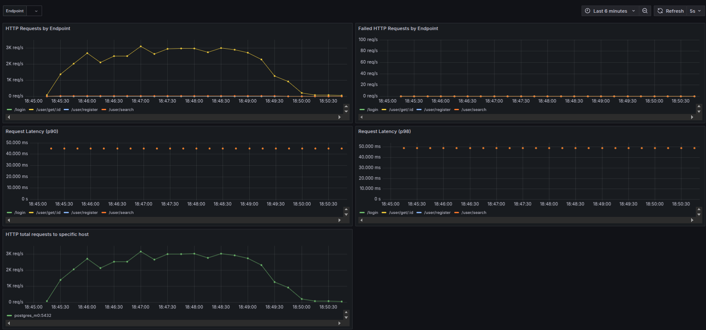
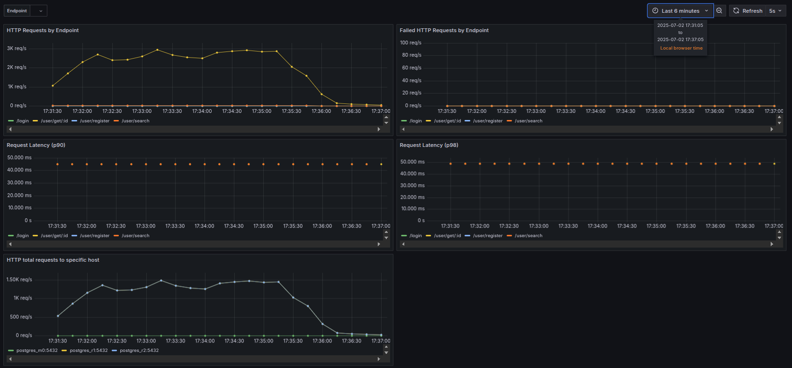
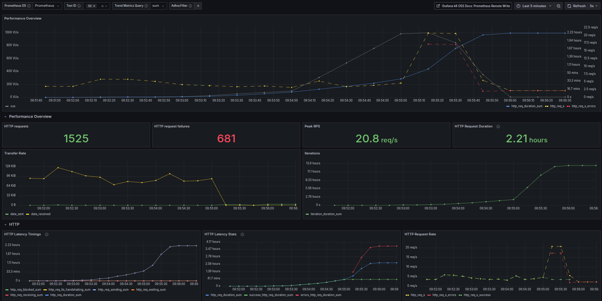
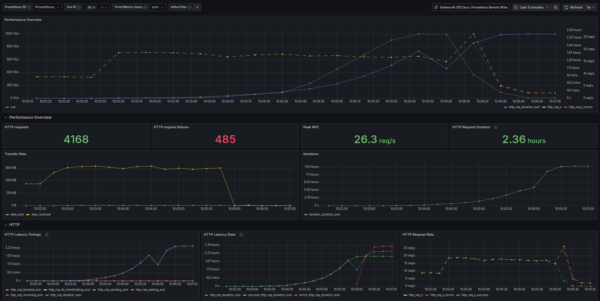
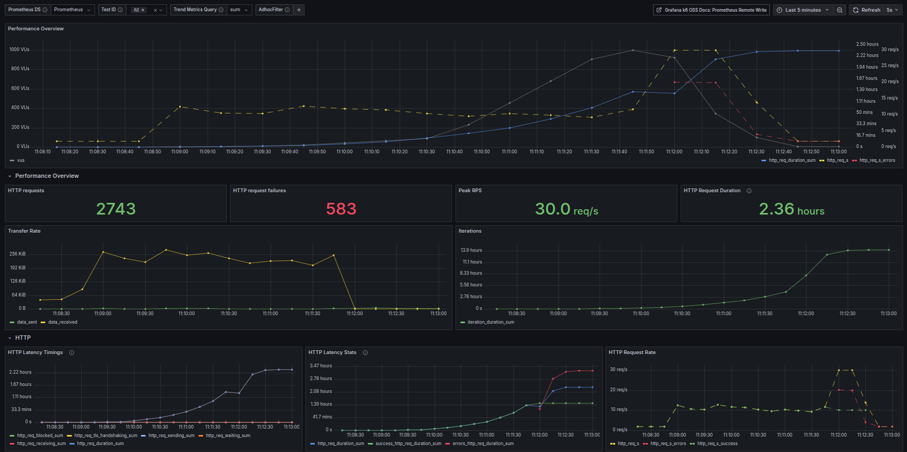
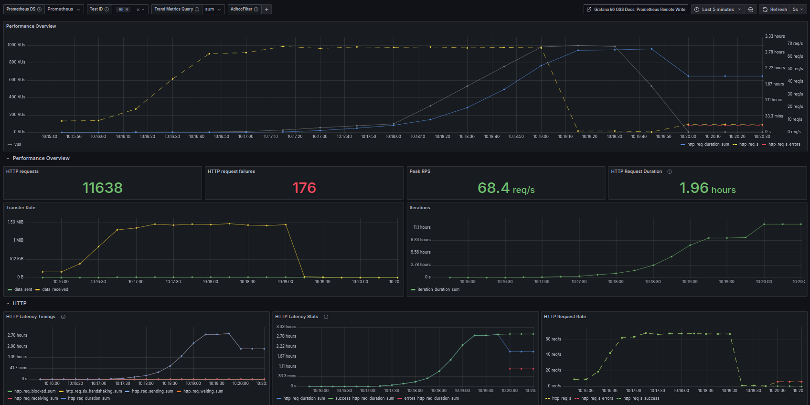

# Сервис социальной сети (курс Highload Architect)

## ДЗ 3: Репликация

### Описание нагрузочного теста на чтение

* в качестве нагрузки на чтение используется тест из файла `k6_tests/search_and_get.js`

* схема нагрузки:
  * в первую минуту - 50 клиент  
  * далее в течении 3 минут - 200 клиентов
  * в последнюю минуту - нагрузка снижается до 0 клиентов

* выполняется нагрузка на запросы чтения по двум эндпойнтам:
  * `/user/search`
  * `/user/get/`

* клиенты для `/user/search` выбирают произвольно один из следующих видов запросов:
  * `/user/search?first_name=Ив&last_name=Ив`
  * `/user/search?first_name=Ал&last_name=Ал`
  * `/user/search?first_name=Сер&last_name=Сер`

* затем для возвращенного списка в цикле пробегаемся по элементам массива и делаем `/user/get/`/

### Описание нагрузочного теста на запись


### Мониторинг результатов

* для сбора и экспорта метрик Docker и некоторых системных показателей в Prometheus дополнительно будет развернуто несколько контейнеров:
  * `prom/node-exporter`
  * `google/cadvisor`

* в файл `monitoring/prometheus/prometheus.yml` с конфигурацией Prometheus, добавлены эти два новых источника метрик

* в Grafana загружены дашборды, в том числе стандартный с ID 893 (`monitoring/grafana/dashboards/cadvisor_prometheus_893.json`) для мониторинга Docker и некоторых системных показателей

* также обновлен дашборд `monitoring/grafana/dashboards/social.json`, в нем появился график, показывающий распределение запросов по хостам БД

### Разворачивание нескольких БД в режиме репликации

* в каталоге `replication` создать 3 подкаталога для данных каждой БД:
  * `postgres_m0_data` - база мастера
  * `postgres_r1_data` - база реплики 1
  * `postgres_r2_data` - база реплики 2

* развернуть контейнер **postgres_m0**

```bash
docker compose -f docker-compose.service-replication.yml run -d postgres_m0
```

* сгенерировать как в ДЗ 1 тестовый набор пользователей

* выполнить создание базы в контейнере **postgres_m0**

```bash
docker exec -it postgres_m0 psql -U postgres -c "
CREATE TABLE IF NOT EXISTS users (
  id          UUID         PRIMARY KEY DEFAULT gen_random_uuid(),
  created_at  TIMESTAMP    NOT NULL DEFAULT NOW(),
  pwd_hash    VARCHAR(100) NOT NULL,
  first_name  VARCHAR(50)  NOT NULL,
  second_name VARCHAR(50)  NOT NULL,
  birthdate   DATE,
  biography   TEXT,
  city        VARCHAR(50)
);"
```

* выполнить загрузку тестового набора пользователей в контейнер **postgres_m0**

```bash
docker exec -it postgres_m0 psql -U postgres -c "
COPY users(second_name, first_name, birthdate, biography, city, pwd_hash)
FROM '/tmp/users.csv' DELIMITER ',' CSV HEADER;"
```

* создать индекс в контейнере **postgres_m0**

```bash
docker exec -it postgres_m0 psql -U postgres -c "
CREATE INDEX IF NOT EXISTS users_names_btree_idx
ON users(first_name text_pattern_ops, second_name text_pattern_ops);"
```

* создать роль для репликации в контейнере **postgres_m0**

```bash
docker exec -it postgres_m0 psql -U postgres -c "
CREATE ROLE replicator
WITH LOGIN replication PASSWORD 'rpass';"
```

* при запуске docker compose создалась сеть `social_network_net`, в которой работают контейнеры, запомним подсеть

```bash
docker network inspect social_network_net | grep -ai subnet
                    "Subnet": "172.21.0.0/16",
```

* при запуске docker compose в каталоге `replication/postgres_m0_data` располагаются файлы базы мастера
  * изменить файл `replication/postgres_m0_data/pg_hba.conf`, добавив запись в подсетью:

  ```text
  host    replication     replicator      172.21.0.0/16           md5
  ```

  * изменить файл `replication/postgres_m0_data/postgresql.conf` следующим образом:
    * `ssl = off`
    * `wal_level = replica`
    * `max_wal_senders = 4`

* перезапустить мастер **postgres_m0** для применения настроек

```bash
docker restart postgres_m0
```

* подключиться к контейнеру и сделать бекап базы

```bash
docker exec -it postgres_m0 /bin/sh
mkdir /pgbackup
pg_basebackup -h postgres_m0 -D /pgbackup -U replicator -v -P --wal-method=stream
exit
```

* сохранить бекап базы к себе, а затем распихать по каталогам для реплик

```bash
docker cp postgres_m0:/pgbackup ./replication/pgbackup
cp -r ./replication/pgbackup/* ./replication/postgres_r1_data/
cp -r ./replication/pgbackup/* ./replication/postgres_r2_data/
```

* создать специальный файл, чтобы реплики знали, что они реплики

```bash
touch ./replication/postgres_r1_data/standby.signal
touch ./replication/postgres_r2_data/standby.signal
```

* изменить `./replication/postgres_r1_data/postgresql.conf` для реплики **postgres_r1**

```bash
primary_conninfo = 'host=postgres_m0 port=5432 user=replicator password=rpass application_name=postgres_r1'
```

* изменить `./replication/postgres_r2_data/postgresql.conf` для реплики **postgres_r2**

```bash
primary_conninfo = 'host=postgres_m0 port=5432 user=replicator password=rpass application_name=postgres_r2'
```

* запустить контейнеры реплик **postgres_r1** и **postgres_r2**

```bash
docker compose -f docker-compose.service-replication.yml run -d postgres_r1
docker compose -f docker-compose.service-replication.yml run -d postgres_r2
```

* убедиться, что обе реплики работают в асинхронном режиме на **postgres_m0**

```bash
docker exec -it postgres_m0 psql -U postgres -c "
SELECT application_name, sync_state FROM pg_stat_replication;"

 application_name | sync_state 
------------------+------------
 postgres_r1      | async
 postgres_r2      | async
(2 rows)
```

* включить синхронную репликацию на мастере **postgres_m0**:
  * изменить файл `./replication/postgres_m0_data/postgresql.conf`:
    * `synchronous_commit = on`
    * `synchronous_standby_names = 'FIRST 1 (postgres_r1, postgres_r2)'`
  * перезагрузить конфиг конфиг

  ```bash
  docker exec -it postgres_m0 su - postgres -c psql
  select pg_reload_conf();
  exit
  ```

* убедиться, что репликация стала синхронной

```bash
docker exec -it postgres_m0 psql -U postgres -c "
SELECT application_name, sync_state FROM pg_stat_replication;"

 application_name | sync_state 
------------------+------------
 postgres_r1      | sync
 postgres_r2      | potential
(2 rows)
```

### Тест на распределенное чтение

* подготовить систему без учета реплик
  * в файле `docker-compose.service-replication.yml` для сервиса **social_srv** закомментировать переменные окружения:
    * `PGSQL_REPLICA_1_URL`
    * `PGSQL_REPLICA_2_URL`

  * развернуть

  ```bash
  docker compose -f docker-compose.service-replication.yml -f docker-compose.monitoring.yml -f docker-compose.loadtest.yml up -d

  # по окончании работы остановить систему командой
  docker compose -f docker-compose.service-replication.yml -f docker-compose.monitoring.yml -f docker-compose.loadtest.yml down --remove-orphans
  ```

  * запустить тест

  ```bash
  docker compose -f docker-compose.service-replication.yml -f docker-compose.monitoring.yml -f docker-compose.loadtest.yml run k6 run --verbose --out experimental-prometheus-rw /tests/search_and_get.js
  ```

* подготовить систему с учетом реплик
  * в файле `docker-compose.service-replication.yml` для сервиса **social_srv** оставить переменные окружения:
    * `PGSQL_REPLICA_1_URL`
    * `PGSQL_REPLICA_2_URL`

  * развернуть

  ```bash
  docker compose -f docker-compose.service-replication.yml -f docker-compose.monitoring.yml -f docker-compose.loadtest.yml up -d

  # по окончании работы остановить систему командой
  docker compose -f docker-compose.service-replication.yml -f docker-compose.monitoring.yml -f docker-compose.loadtest.yml down --remove-orphans
  ```

  * запустить тест

  ```bash
  docker compose -f docker-compose.service-replication.yml -f docker-compose.monitoring.yml -f docker-compose.loadtest.yml run k6 run --verbose --out experimental-prometheus-rw /tests/search_and_get.js
  ```

* результаты тестов K6, чтение только из одной базы

```text
DEBU[0330] Usage report sent successfully               


  █ TOTAL RESULTS 

    checks_total.......................: 682936 2069.492702/s
    checks_succeeded...................: 99.06% 676536 out of 682936
    checks_failed......................: 0.09%  585 out of 682936

    ✗ search status 200
      ↳  99% — ✓ 7166 / ✗ 10
    ✗ get status 200
      ↳  99% — ✓ 668847 / ✗ 4884

    HTTP
    http_req_duration.......................................................: avg=39.99ms min=0s       med=2.9ms  max=17.07s p(90)=86.18ms p(95)=129.35ms
      { expected_response:true }............................................: avg=40.37ms min=287.22µs med=2.97ms max=17.07s p(90)=86.78ms p(95)=130.05ms
    http_req_failed.........................................................: 0.93%  6400 out of 682936
    http_reqs...............................................................: 682936 2069.492702/s

    EXECUTION
    iteration_duration......................................................: avg=3.04s   min=12.01ms  med=1.96s  max=1m26s  p(90)=6.85s   p(95)=8.9s    
    iterations..............................................................: 9067   27.47562/s
    vus.....................................................................: 1      min=1              max=200
    vus_max.................................................................: 200    min=200            max=200

    NETWORK
    data_received...........................................................: 525 MB 1.6 MB/s
    data_sent...............................................................: 79 MB  238 kB/s


running (5m30.0s), 000/200 VUs, 9067 complete and 138 interrupted iterations
default ✓ [======================================] 000/200 VUs  5m0s
```

* результаты тестов K6, распределенное чтение из реплик

```text
DEBU[0330] Usage report sent successfully               


  █ TOTAL RESULTS 

    checks_total.......................: 640916 1945.695915/s
    checks_succeeded...................: 99.93% 640478 out of 640916
    checks_failed......................: 0.06%  438 out of 640916

    ✗ search status 200
      ↳  99% — ✓ 7196 / ✗ 9
    ✗ get status 200
      ↳  99% — ✓ 633282 / ✗ 429

    HTTP
    http_req_duration.......................................................: avg=46.11ms min=0s       med=3.59ms max=18.24s p(90)=115.03ms p(95)=144.31ms
      { expected_response:true }............................................: avg=46.14ms min=296.27µs med=3.59ms max=18.24s p(90)=115.06ms p(95)=144.33ms
    http_req_failed.........................................................: 0.06%  438 out of 640916
    http_reqs...............................................................: 640916 1945.695915/s

    EXECUTION
    iteration_duration......................................................: avg=3.95s   min=41.23ms  med=3.1s   max=1m23s  p(90)=7.56s    p(95)=8.59s   
    iterations..............................................................: 7072   21.469212/s
    vus.....................................................................: 2      min=1             max=200
    vus_max.................................................................: 200    min=200           max=200

    NETWORK
    data_received...........................................................: 496 MB 1.5 MB/s
    data_sent...............................................................: 74 MB  226 kB/s


running (5m29.4s), 000/200 VUs, 7072 complete and 133 interrupted iterations
default ✓ [======================================] 000/200 VUs  5m0s
```

* результаты тестов по дашборду Grafana, чтение только из одной базы


* результаты тестов по дашборду Grafana, распределенное чтение из реплик


**ВЫВОДЫ:**

1. удалось распределить чтение по репликам, полностью сняв нагрузку на чтение с ноды мастера
2. в случае чтения без репликации, все запросы уходят на единственный узел **postgres_m0**
3. в случае чтения с репликацией, т.к. выполняются запросы только на чтение, на графиках не видно никаких обращений к хосту **postgres_m0**, все запросы поступают на реплики и распределяются поровну
4. распределение выбора между репликами осуществляется по алгоритму Round Robin, этим объясняется одинаковость графиков для хостов **postgres_r1** и **postgres_r2**, т.к. запросы распределяются по ним равномерно
5. результаты тестов K6 показывают несколько ошибок, а на графиках их нет, это связано с тем, что некоторое количество запросов "/user/search" выполняется долго и K6 отваливается по таймауту, списывая их в ошибку, но по метрикам в Prometheus видно, что запрос по итогу отрабатывает успешно


### Тест на запись в реплицированную базу


## ДЗ 2: Производительность индексов

* развернуть систему

```bash
docker compose -f docker-compose.service-single.yml -f docker-compose.monitoring.yml -f docker-compose.loadtest.yml up -d

# по окончании работы остановить систему командой
docker compose -f docker-compose.service-single.yml -f docker-compose.monitoring.yml -f docker-compose.loadtest.yml down --remove-orphans
```

### Генерация правдоподобных данных

Для генерации 1кк реалистичных записей в базе данных, надо воспользоваться Python-скриптом `users_generator/generate_users.py`. Для работы скрипта кроме установленного интерпретатора python3, потребуется еще и пакет Faker:

```bash
python3 -m pip install faker

python3 -m pip show faker
Name: Faker
Version: 35.2.2
Summary: Faker is a Python package that generates fake data for you.
Home-page: https://github.com/joke2k/faker
Author: joke2k
Author-email: joke2k@gmail.com
License: MIT License
Location: /home/user/.local/lib/python3.8/site-packages
Requires: python-dateutil, typing-extensions
Required-by:
```

Для своей работы он использует файлы:

* `users_generator/cities_raw.csv` - список названий городов,
* `users_generator/interests_raw.csv` - список наименований интересов
* `users_generator/people_raw.csv` - список пользователей в формате "Фамилия Имя"

По окончании работы, будет сгенерирован файл `users_generator/users.csv` с последовательностью полей `second_name,first_name,birthdate,biography,city,pwd_hash`.  
В качестве интересов, используются по 3 штуки, произвольно выбранных из списка `users_generator/interests_raw.csv`.  
Город выбирается рандомно из списка `users_generator/cities_raw.csv`.  
Возраст генерируется рандомно в диапазоне от 18 до 70 лет.  
Пароль в виде bcrypt-хэша используется для всех одинаковый.

### Импорт сгенерированных данных в БД

Полученный файл нужно загрузить в базу. Для этого:

* первоначально очистить каталог `postgres_db` от старой базы после экспериментов по ДЗ 1,

* скопировать сгенерированный файл в контейнер БД

```bash
docker cp users_generator/users.csv postgres_db:/tmp/users.csv
```

* произвести импорт из файла

```bash
docker exec -it postgres_db psql -U postgres -c "
  COPY users(second_name, first_name, birthdate, biography, city, pwd_hash)
  FROM '/tmp/users.csv' DELIMITER ',' CSV HEADER;"

COPY 1000000
```

* проверить наличие записей в таблице

```bash
docker exec -it postgres_db psql -U postgres -c "SELECT count(*) FROM users;"

  count  
---------
 1000000
(1 row)
```

* если запущена версия БД без индексов, то EXPLAIN покажет нечто следующее:

```bash
docker exec -it postgres_db psql -U postgres -c "EXPLAIN ANALYZE
SELECT * FROM users WHERE first_name LIKE 'Ив%' AND second_name LIKE 'Ив%';"

                                                        QUERY PLAN                                                        
--------------------------------------------------------------------------------------------------------------------------
 Gather  (cost=1000.00..37636.15 rows=500 width=209) (actual time=0.307..50.366 rows=503 loops=1)
   Workers Planned: 2
   Workers Launched: 2
   ->  Parallel Seq Scan on users  (cost=0.00..36586.15 rows=208 width=209) (actual time=29.464..45.486 rows=168 loops=3)
         Filter: (((first_name)::text ~~ 'Ив%'::text) AND ((second_name)::text ~~ 'Ив%'::text))
         Rows Removed by Filter: 333166
 Planning Time: 1.056 ms
 Execution Time: 50.466 ms
(8 rows)
```

* если запущена версия БД с индексами, то EXPLAIN покажет нечто следующее:

```bash
docker exec -it postgres_db psql -U postgres -c "EXPLAIN ANALYZE
SELECT * FROM users WHERE first_name LIKE 'Ив%' AND second_name LIKE 'Ив%';"

                                                                                      QUERY PLAN                                                                                       
---------------------------------------------------------------------------------------------------------------------------------------------------------------------------------------
 Bitmap Heap Scan on users  (cost=396.54..2149.55 rows=487 width=209) (actual time=0.197..1.159 rows=503 loops=1)
   Filter: (((first_name)::text ~~ 'Ив%'::text) AND ((second_name)::text ~~ 'Ив%'::text))
   Heap Blocks: exact=273
   ->  Bitmap Index Scan on users_names_btree_idx  (cost=0.00..396.42 rows=485 width=0) (actual time=0.161..0.161 rows=503 loops=1)
         Index Cond: (((first_name)::text ~>=~ 'Ив'::text) AND ((first_name)::text ~<~ 'Иг'::text) AND ((second_name)::text ~>=~ 'Ив'::text) AND ((second_name)::text ~<~ 'Иг'::text))
 Planning Time: 1.251 ms
 Execution Time: 1.267 ms
(7 rows)
```

В случае без индексов используется **Parallel Seq Scan**, а при использовании индекса - **Bitmap Index Scan**.

### Дашборд в Grafana

Docker-compose разворачивает кроме контейнера сервиса и БД, теперь еще несколько контейнеров:

* **prometheus** - Prometheus с открытым портом 9090 в той же сети,
* **grafana** - Grafana с открытым портом 3000 в той же сети,
* **postgres_exporter** - специальный экспортёр метрик из PostgreSQL в Prometheus. Он зависит от контейнера нашей БД.

Во время разворачивания, через volume в контейнер Prometheus загружается конфигурационный файл `monitoring/prometheus/prometheus.yml`, в котором предварительно настроены три задачи на сбор метрик каждые 5 секунд:

* одна собирает метрики по URL (`/metrics`) из `postgres_exporter:9187`, т.е. экспортера БД,
* другая собирает метрики по URL (`/metrics`) из `social_srv:6001`, т.е. нашего сервиса,
* третья собирает свои собственные метрики Prometheus.

В нашем сервисе реализован сбор следующих Prometheus-метрик:

* **http_requests_total** - (Counter) общее количество HTTP запросов, отдельно по каждому эндпоинту (`/login`, `/user/register`, `/user/get/:id`, `/user/search`),
* **http_requests_failed_total** - (Counter) количество HTTP запросов завершенных с ошибкой, отдельно по каждому эндпоинту (`/login`, `/user/register`, `/user/get/:id`, `/user/search`),
* **http_request_duration_seconds** - (Histogram) время выполнения HTTP запросов, отдельно по каждому эндпоинту (`/login`, `/user/register`, `/user/get/:id`, `/user/search`).

Во время разворачивания, через volume в контейнер Grafana загружаются конфигурационные файлы `monitoring/grafana/datasources/datasources.yml` и `monitoring/grafana/dashboards/dashboards.yml`, которые включают Prometheus как источник данных, и загружают преднастроенные дашборды.  
Также в контейнер монтируется дашборд для мониторинга метрик нашего сервиса, он в файле `monitoring/social_dashboard.json`.  
Также в контейнер монтируется дашборд для мониторинга метрик K6, он `monitoring/grafana/dashboards/k6_prometheus_19665.json`, и по факту это обычный дашборд с ID 19665, который можно загрузить.

Чтобы посмотреть дашборды в Grafana, после разворачивания необходимо перейти в браузере по адресу
`http://localhost:3000/`.

### Индексирование базы

В качестве индекса был выбран **B-tree**. Однако, для B-tree надо использовать `text_pattern_ops`, т.к. по умолчанию он не поддерживает поиск по префиксу (LIKE 'Ив%') для типов данных text/varchar.  
А для поисков по суффиксу и вхождению подстроки - B-tree вообще не подходит.

Индекс используется составной (first_name, second_name). Как раз потому что для исполнения запроса по эндпоинту `/user/search` и надо выполнить поиск именно по Имени и Фамилии.

Можно было бы также использовать индекс типа **GIN** для поисков по суффиксу и вхождению подстроки (LIKE '%ан%'), при этом надо включить расширение **trigram**.  
Однако GIN работает медленнее B-tree и занимает значительно больше места, хотя и позволяет более гибкие варианты поиска.

**ПРИМЕЧАНИЕ:** тем не менее, почему-то когда я настраивал этот индекс, то просто так планировщик не захотел его применять. Вместо него предпочел Parallel Seq Scan для запросов (first_name LIKE '%ва%' AND second_name LIKE '%ан%').  
Вероятно дело в отсутствии статистики у планировщика, или оказалась очень низкая селективность и планировщик отбросил этот индекс.  
По итогу получается, что только для префиксного поиска достаточно и более быстрого B-tree.  
В общем, в дальнейшем сравнивается именно составной индекс **B-tree**.

### Тест нагрузки

* для обеспечение нагрузки используется инструмент K6

* тест нагрузки для K6 находится в файле `k6_tests/user_search.js`

* файл монтируется в контейнер при запуске

* схема нагрузки:
  * в первые 30 секунд - 1 клиент  
  * далее в течении 1 минуты - 10 клиентов
  * далее в течении 1 минуты - 100 клиентов
  * далее в течении 1 минуты - 1000 клиентов
  * в последние 30 секунд - нагрузка снижается до 0 клиентов

* клиенты выбирают произвольно один из следующих видов запросов:
  * `/user/search?first_name=Ив&last_name=Ив`
  * `/user/search?first_name=Ал&last_name=Ал`
  * `/user/search?first_name=Сер&last_name=Сер`

### Производительность сервиса

В корне проекта находится файл `.env` с переменными окружения, которые используются для разворачивания контейнеров через `docker compose`. В том числе там находятся несколько переменных, позволяющих затюнить работу сервиса:

* `ENV_HTTP_THREADS_COUNT` - задает количество потоков ThreadPool, в которых происходит исполнение запросов
* `ENV_HTTP_QUEUE_CAPACITY` - задает размер очереди задач, которые можно положить в ThreadPool, которые поочереди будут извлекать и исполнять потоки ThreadPool.

Ниже проводилась проверка следующих комбинаций (скриншоты результатов из K6 дашборда Grafana почему-то неправильно отображаются единицы измерения Latency и Duration):

* потоков в сервисе: 1, ёмкость буфера HTTP запросов: 1000, индексы в базе: нет  



* потоков в сервисе: 1, ёмкость буфера HTTP запросов: 1000, индексы в базе: btree



* потоков в сервисе: 4, ёмкость буфера HTTP запросов: 4096, индексы в базе: нет



* потоков в сервисе: 4, ёмкость буфера HTTP запросов: 4096, индексы в базе: btree



### Сравнение однопоточного и многопоточного режима работы сервиса (БД без индексов)

* убедиться, что индексов нет

```bash
docker exec -it postgres_db psql -U postgres -c "DROP INDEX IF EXISTS users_names_btree_idx;"
```

* запустить тест

```bash
docker compose run -e TEST_TYPE=no-index k6 run --verbose --out experimental-prometheus-rw /tests/user_search.js
```

* по окончании тестов в логе покажется следующий результат (ниже приведены результаты сразу для двух запусков, когда сервис работает в 1 поток и в 4 потока):

  * индексы в базе: **нет**, потоков в сервисе: **1**:

  ```text
  DEBU[0270] Generating the end-of-test summary...        
       ✗ status 200
        ↳  55% — ✓ 844 / ✗ 681
       ✗ response time <500ms
        ↳  33% — ✓ 505 / ✗ 1020
  
       checks.........................: 44.22% ✓ 1349     ✗ 1701  
       data_received..................: 20 MB  72 kB/s
       data_sent......................: 247 kB 915 B/s
       http_req_blocked...............: avg=284.85µs     min=3.98µs    med=198.69µs     max=26.89ms      p(90)=528.03µs     p(95)=568.03µs    
       http_req_connecting............: avg=223.63µs     min=0s        med=144.97µs     max=26.83ms      p(90)=362.84µs     p(95)=394.6µs     
       http_req_duration..............: avg=31.32s       min=52.5ms    med=36.51s       max=1m0s         p(90)=1m0s         p(95)=1m0s        
         { expected_response:true }...: avg=8.18s        min=52.5ms    med=389.99ms     max=59.94s       p(90)=35.63s       p(95)=46.36s      
       http_req_failed................: 44.65% ✓ 681      ✗ 844   
       http_req_receiving.............: avg=54.81µs      min=0s        med=64.92µs      max=286.71µs     p(90)=128.99µs     p(95)=145.02µs    
       http_req_sending...............: avg=57.29µs      min=11.32µs   med=47.08µs      max=280.97µs     p(90)=116.7µs      p(95)=138.49µs    
       http_req_tls_handshaking.......: avg=0s           min=0s        med=0s           max=0s           p(90)=0s           p(95)=0s          
       http_req_waiting...............: avg=31.32s       min=52.42ms   med=36.51s       max=1m0s         p(90)=1m0s         p(95)=1m0s        
       http_reqs......................: 1525   5.648742/s
       iteration_duration.............: avg=31.4s        min=153.11ms  med=36.32s       max=1m0s         p(90)=1m0s         p(95)=1m0s        
       iterations.....................: 1524   5.645038/s
       search_duration................: avg=31322.413353 min=52.505492 med=36514.800854 max=60001.951364 p(90)=60000.731109 p(95)=60000.881857
       search_errors..................: 681    2.522487/s
       search_latency.................: avg=31.32s       min=52ms      med=36.51s       max=1m0s         p(90)=1m0s         p(95)=1m0s        
       search_success.................: 55.34% ✓ 844      ✗ 681   
       vus............................: 4      min=1      max=1000
  
  running (4m30.0s), 0000/1000 VUs, 1524 complete and 638 interrupted iterations
  default ✓ [======================================] 0000/1000 VUs  4m0s
  ```

  * индексы в базе: **нет**, потоков в сервисе: **4**:

  ```text
  DEBU[0270] Generating the end-of-test summary...        
       ✗ status 200
        ↳  78% — ✓ 2160 / ✗ 583
       ✗ response time <500ms
        ↳  36% — ✓ 996 / ✗ 1747
  
       checks.........................: 57.52% ✓ 3156      ✗ 2330  
       data_received..................: 49 MB  180 kB/s
       data_sent......................: 376 kB 1.4 kB/s
       http_req_blocked...............: avg=200.33µs     min=2.42µs    med=185.53µs   max=33.36ms      p(90)=272.06µs     p(95)=359.63µs    
       http_req_connecting............: avg=156.34µs     min=0s        med=133.95µs   max=33.3ms       p(90)=201.08µs     p(95)=267.8µs     
       http_req_duration..............: avg=18.56s       min=51.78ms   med=931.15ms   max=1m0s         p(90)=1m0s         p(95)=1m0s        
         { expected_response:true }...: avg=7.38s        min=51.78ms   med=565.2ms    max=59.96s       p(90)=28.57s       p(95)=44.97s      
       http_req_failed................: 21.25% ✓ 583       ✗ 2160  
       http_req_receiving.............: avg=96.85µs      min=0s        med=96.02µs    max=1.32ms       p(90)=159.64µs     p(95)=202.41µs    
       http_req_sending...............: avg=39.02µs      min=5.69µs    med=33.59µs    max=5.07ms       p(90)=56.95µs      p(95)=69.69µs     
       http_req_tls_handshaking.......: avg=0s           min=0s        med=0s         max=0s           p(90)=0s           p(95)=0s          
       http_req_waiting...............: avg=18.56s       min=51.68ms   med=931.04ms   max=1m0s         p(90)=1m0s         p(95)=1m0s        
       http_reqs......................: 2743   10.160335/s
       iteration_duration.............: avg=18.62s       min=152.45ms  med=1.01s      max=1m0s         p(90)=1m0s         p(95)=1m0s        
       iterations.....................: 2740   10.149223/s
       search_duration................: avg=18569.778054 min=51.780118 med=931.157741 max=60011.798556 p(90)=60000.534644 p(95)=60000.786315
       search_errors..................: 583    2.159488/s
       search_latency.................: avg=18.57s       min=52ms      med=931ms      max=1m0s         p(90)=1m0s         p(95)=1m0s        
       search_success.................: 78.74% ✓ 2160      ✗ 583   
       vus............................: 4      min=1       max=1000
  
  running (4m30.0s), 0000/1000 VUs, 2740 complete and 549 interrupted iterations
  default ✓ [======================================] 0000/1000 VUs  4m0s
  ```

**ВЫВОДЫ:** увеличение потоков в сервисе в 4 раза привело к:

1. количество успешных запросов (без ошибки и без таймаута) увеличилось, т.к. больше обработчиков (search_success: 55.34% -> 78.74%)
2. количество запросов, обработанных менее чем за 500 мс в пределах погрешности, т.к. запросы те же, база та же, индексов нет (response time <500ms: 33% -> 36%)
3. (Throughput) увеличение производительности в 1,8 раза, т.к. больше обработчиков (http_reqs: 1525 -> 2743)
4. (Latency) максимальное время получения ответа не поменялось, т.к. таймаут ожидания, 4 обработчика не успевают перемолоть все запросы (search_latency max: 1m0s -> 1m0s)
5. (Latency) минимальное время получения ответа не поменялось, т.к. запросы те же, база та же, индексов нет (search_latency min: 52ms -> 52ms)
6. (Latency) медианное время получения ответа уменьшилось, т.к. больше обработчиков (search_latency med: 36.51s -> 931ms)

### Сравнение однопоточного и многопоточного режима работы сервиса (БД с индексом)

* добавить индекс командой

```bash
docker exec -it postgres_db psql -U postgres -c "CREATE INDEX IF NOT EXISTS users_names_btree_idx ON users(first_name text_pattern_ops, second_name text_pattern_ops);"
```

* запустить тесты

```bash
docker compose run -p 6565:6565 -e TEST_TYPE=with-index k6 run --verbose --out experimental-prometheus-rw /tests/user_search.js
```

* по окончании тестов в логе покажется следующий результат (ниже приведены результаты сразу для двух запусков, когда сервис работает в 1 поток и в 4 потока):

  * индексы в базе: **btree**, потоков в сервисе: **1**:

  ```text
  DEBU[0270] Generating the end-of-test summary...        
       ✗ status 200
        ↳  88% — ✓ 3683 / ✗ 485
       ✗ response time <500ms
        ↳  55% — ✓ 2311 / ✗ 1857
  
       checks.........................: 71.90% ✓ 5994      ✗ 2342  
       data_received..................: 84 MB  311 kB/s
       data_sent......................: 537 kB 2.0 kB/s
       http_req_blocked...............: avg=252.61µs     min=2.6µs    med=171.59µs   max=26.16ms      p(90)=565.24µs     p(95)=590.45µs    
       http_req_connecting............: avg=181.82µs     min=0s       med=123.68µs   max=26.01ms      p(90)=397.41µs     p(95)=412.52µs    
       http_req_duration..............: avg=12.25s       min=1.34ms   med=110.99ms   max=1m0s         p(90)=59.99s       p(95)=1m0s        
         { expected_response:true }...: avg=5.96s        min=1.34ms   med=12.19ms    max=59.98s       p(90)=25.48s       p(95)=39.39s      
       http_req_failed................: 11.63% ✓ 485       ✗ 3683  
       http_req_receiving.............: avg=156.9µs      min=0s       med=159.8µs    max=1.86ms       p(90)=294.09µs     p(95)=325.14µs    
       http_req_sending...............: avg=65.95µs      min=4.74µs   med=48.05µs    max=326.04µs     p(90)=140.33µs     p(95)=172.28µs    
       http_req_tls_handshaking.......: avg=0s           min=0s       med=0s         max=0s           p(90)=0s           p(95)=0s          
       http_req_waiting...............: avg=12.25s       min=1.27ms   med=110.89ms   max=1m0s         p(90)=59.99s       p(95)=1m0s        
       http_reqs......................: 4168   15.436789/s
       iteration_duration.............: avg=12.32s       min=101.46ms med=211.81ms   max=1m0s         p(90)=1m0s         p(95)=1m0s        
       iterations.....................: 4166   15.429382/s
       search_duration................: avg=12251.584748 min=1.344048 med=110.990774 max=60003.661228 p(90)=59999.912329 p(95)=60000.394034
       search_errors..................: 485    1.796267/s
       search_latency.................: avg=12.25s       min=1ms      med=111.5ms    max=1m0s         p(90)=1m0s         p(95)=1m0s        
       search_success.................: 88.36% ✓ 3683      ✗ 485   
       vus............................: 3      min=1       max=1000
  
  running (4m30.0s), 0000/1000 VUs, 4166 complete and 534 interrupted iterations
  default ✓ [======================================] 0000/1000 VUs  4m0s
  ```

  * индексы в базе: **btree**, потоков в сервисе: **4**:

  ```text
  DEBU[0270] Generating the end-of-test summary...        
       ✗ status 200
        ↳  98% — ✓ 11462 / ✗ 176
       ✗ response time <500ms
        ↳  64% — ✓ 7512 / ✗ 4126
  
       checks.........................: 81.51% ✓ 18974     ✗ 4302  
       data_received..................: 255 MB 944 kB/s
       data_sent......................: 1.4 MB 5.3 kB/s
       http_req_blocked...............: avg=248.94µs    min=2.1µs    med=142.39µs  max=20.99ms      p(90)=546.52µs    p(95)=574.08µs    
       http_req_connecting............: avg=174.35µs    min=0s       med=103.85µs  max=20.86ms      p(90)=386.02µs    p(95)=404.35µs    
       http_req_duration..............: avg=3.62s       min=1.33ms   med=12.66ms   max=1m0s         p(90)=13.79s      p(95)=19.1s       
         { expected_response:true }...: avg=2.76s       min=1.33ms   med=12.46ms   max=59.97s       p(90)=12.38s      p(95)=17.58s      
       http_req_failed................: 1.51%  ✓ 176       ✗ 11462 
       http_req_receiving.............: avg=214.41µs    min=0s       med=204µs     max=16.15ms      p(90)=322.83µs    p(95)=385.69µs    
       http_req_sending...............: avg=71.14µs     min=5.78µs   med=50.86µs   max=6.85ms       p(90)=135.15µs    p(95)=160.38µs    
       http_req_tls_handshaking.......: avg=0s          min=0s       med=0s        max=0s           p(90)=0s          p(95)=0s          
       http_req_waiting...............: avg=3.62s       min=1.25ms   med=12.3ms    max=1m0s         p(90)=13.79s      p(95)=19.1s       
       http_reqs......................: 11638  43.103091/s
       iteration_duration.............: avg=3.7s        min=101.55ms med=113.93ms  max=1m0s         p(90)=13.85s      p(95)=19.18s      
       iterations.....................: 11633  43.084573/s
       search_duration................: avg=3629.166481 min=1.330851 med=12.663619 max=60003.465013 p(90)=13797.53092 p(95)=19109.932623
       search_errors..................: 176    0.651843/s
       search_latency.................: avg=3.62s       min=1ms      med=13ms      max=1m0s         p(90)=13.79s      p(95)=19.11s      
       search_success.................: 98.48% ✓ 11462     ✗ 176   
       vus............................: 4      min=1       max=1000
  
  running (4m30.0s), 0000/1000 VUs, 11633 complete and 805 interrupted iterations
  default ✓ [======================================] 0000/1000 VUs  4m0s
  DEBU[0270] Usage report sent successfully               
  DEBU[0270] Everything has finished, exiting k6 normally!
  ```

**ВЫВОДЫ:** увеличение потоков в сервисе в 4 раза привело к:

1. количество успешных запросов (без ошибки и без таймаута) увеличилось, т.к. больше обработчиков (search_success: 88.36% -> 98.48%)
2. количество запросов, обработанных менее чем за 500 мс увеличилось, т.к. больше обработчиков (response time <500ms: 55% -> 64%)
3. (Throughput) увеличение производительности в 2,8 раза, т.к. больше обработчиков (http_reqs: 4168 -> 11638)
4. (Latency) максимальное время получения ответа не поменялось, т.к. таймаут ожидания, 4 обработчика не успевают перемолоть все запросы (search_latency max: 1m0s -> 1m0s)
5. (Latency) минимальное время получения ответа не поменялось, т.к. запросы те же, база та же, индексы те же (search_latency min: 1ms -> 1ms)
6. (Latency) медианное время получения ответа уменьшилось, т.к. больше обработчиков (search_latency med: 111.5ms -> 13ms)

### Сравнение вариантов БД без индекса и с индексом (с одинаковым количеством потоков в сервисе)

* индексы в базе: **нет**, потоков в сервисе: **4**:

```text
DEBU[0270] Generating the end-of-test summary...        
     ✗ status 200
      ↳  78% — ✓ 2160 / ✗ 583
     ✗ response time <500ms
      ↳  36% — ✓ 996 / ✗ 1747

     checks.........................: 57.52% ✓ 3156      ✗ 2330  
     data_received..................: 49 MB  180 kB/s
     data_sent......................: 376 kB 1.4 kB/s
     http_req_blocked...............: avg=200.33µs     min=2.42µs    med=185.53µs   max=33.36ms      p(90)=272.06µs     p(95)=359.63µs    
     http_req_connecting............: avg=156.34µs     min=0s        med=133.95µs   max=33.3ms       p(90)=201.08µs     p(95)=267.8µs     
     http_req_duration..............: avg=18.56s       min=51.78ms   med=931.15ms   max=1m0s         p(90)=1m0s         p(95)=1m0s        
       { expected_response:true }...: avg=7.38s        min=51.78ms   med=565.2ms    max=59.96s       p(90)=28.57s       p(95)=44.97s      
     http_req_failed................: 21.25% ✓ 583       ✗ 2160  
     http_req_receiving.............: avg=96.85µs      min=0s        med=96.02µs    max=1.32ms       p(90)=159.64µs     p(95)=202.41µs    
     http_req_sending...............: avg=39.02µs      min=5.69µs    med=33.59µs    max=5.07ms       p(90)=56.95µs      p(95)=69.69µs     
     http_req_tls_handshaking.......: avg=0s           min=0s        med=0s         max=0s           p(90)=0s           p(95)=0s          
     http_req_waiting...............: avg=18.56s       min=51.68ms   med=931.04ms   max=1m0s         p(90)=1m0s         p(95)=1m0s        
     http_reqs......................: 2743   10.160335/s
     iteration_duration.............: avg=18.62s       min=152.45ms  med=1.01s      max=1m0s         p(90)=1m0s         p(95)=1m0s        
     iterations.....................: 2740   10.149223/s
     search_duration................: avg=18569.778054 min=51.780118 med=931.157741 max=60011.798556 p(90)=60000.534644 p(95)=60000.786315
     search_errors..................: 583    2.159488/s
     search_latency.................: avg=18.57s       min=52ms      med=931ms      max=1m0s         p(90)=1m0s         p(95)=1m0s        
     search_success.................: 78.74% ✓ 2160      ✗ 583   
     vus............................: 4      min=1       max=1000

running (4m30.0s), 0000/1000 VUs, 2740 complete and 549 interrupted iterations
default ✓ [======================================] 0000/1000 VUs  4m0s
```

* индексы в базе: **btree**, потоков в сервисе: **4**:

```text
DEBU[0270] Generating the end-of-test summary...        
     ✗ status 200
      ↳  98% — ✓ 11462 / ✗ 176
     ✗ response time <500ms
      ↳  64% — ✓ 7512 / ✗ 4126

     checks.........................: 81.51% ✓ 18974     ✗ 4302  
     data_received..................: 255 MB 944 kB/s
     data_sent......................: 1.4 MB 5.3 kB/s
     http_req_blocked...............: avg=248.94µs    min=2.1µs    med=142.39µs  max=20.99ms      p(90)=546.52µs    p(95)=574.08µs    
     http_req_connecting............: avg=174.35µs    min=0s       med=103.85µs  max=20.86ms      p(90)=386.02µs    p(95)=404.35µs    
     http_req_duration..............: avg=3.62s       min=1.33ms   med=12.66ms   max=1m0s         p(90)=13.79s      p(95)=19.1s       
       { expected_response:true }...: avg=2.76s       min=1.33ms   med=12.46ms   max=59.97s       p(90)=12.38s      p(95)=17.58s      
     http_req_failed................: 1.51%  ✓ 176       ✗ 11462 
     http_req_receiving.............: avg=214.41µs    min=0s       med=204µs     max=16.15ms      p(90)=322.83µs    p(95)=385.69µs    
     http_req_sending...............: avg=71.14µs     min=5.78µs   med=50.86µs   max=6.85ms       p(90)=135.15µs    p(95)=160.38µs    
     http_req_tls_handshaking.......: avg=0s          min=0s       med=0s        max=0s           p(90)=0s          p(95)=0s          
     http_req_waiting...............: avg=3.62s       min=1.25ms   med=12.3ms    max=1m0s         p(90)=13.79s      p(95)=19.1s       
     http_reqs......................: 11638  43.103091/s
     iteration_duration.............: avg=3.7s        min=101.55ms med=113.93ms  max=1m0s         p(90)=13.85s      p(95)=19.18s      
     iterations.....................: 11633  43.084573/s
     search_duration................: avg=3629.166481 min=1.330851 med=12.663619 max=60003.465013 p(90)=13797.53092 p(95)=19109.932623
     search_errors..................: 176    0.651843/s
     search_latency.................: avg=3.62s       min=1ms      med=13ms      max=1m0s         p(90)=13.79s      p(95)=19.11s      
     search_success.................: 98.48% ✓ 11462     ✗ 176   
     vus............................: 4      min=1       max=1000

running (4m30.0s), 0000/1000 VUs, 11633 complete and 805 interrupted iterations
default ✓ [======================================] 0000/1000 VUs  4m0s
DEBU[0270] Usage report sent successfully               
DEBU[0270] Everything has finished, exiting k6 normally!
```

**ВЫВОДЫ:** увеличение потоков в сервисе в 4 раза привело к:

1. количество успешных запросов (без ошибки и без таймаута) увеличилось (search_success: 78.74% -> 98.48%)
2. количество запросов, обработанных менее чем за 500 мс увеличилось (response time <500ms: 36% -> 64%)
3. (Throughput) увеличение производительности в 4,2 раза (http_reqs: 2743 -> 11638)
4. (Latency) максимальное время получения ответа не поменялось, т.к. таймаут ожидания, 4 обработчика не успевают перемолоть все запросы (search_latency max: 1m0s -> 1m0s)
5. (Latency) минимальное время получения ответа значительно уменьшилось (search_latency min: 52ms -> 1ms)
6. (Latency) медианное время получения ответа значительно уменьшилось (search_latency med: 931ms -> 13ms)

Индексы позволяют обрабатывать запросы к БД быстрее (заметно по минимальному и медианному времени ответов), значит обработчики успевают перемолоть больше запросов, а сервис становится производительнее.


## ДЗ 1: Заготовка для социальной сети. Ручная проверка

* развернуть сервис и БД

```bash
docker compose -f docker-compose.service-single.yml up -d

# по окончании работы остановить систему командой
docker compose -f docker-compose.service-single.yml down --remove-orphans
```

* зарегистрировать пользователя REST-запросом

```bash
curl -X POST http://localhost:6000/user/register \
  -H "Content-Type: application/json" \
  -d '{
    "first_name": "Иван",
    "second_name": "Иванов",
    "birthdate": "1990-01-01",
    "biography": "Программирование, музыка",
    "city": "Москва",
    "password": "secret123"
  }'

{"user_id":"8ef1dac2-cf63-473f-82b7-c52876539deb"}
```

* либо можно засунуть тело в JSON-файл (см. файл `misc/user_register.json`) и выполнить команду

```bash
curl -X POST http://localhost:6000/user/register \
  -H "Content-Type: application/json" \
  -d @user_register.json

{"user_id":"9ddbf14a-7dcb-4b12-88d6-50b0d4fb8990"}
```

* залогиниться REST-запросом

```bash
curl -X POST http://localhost:6000/login \
  -H "Content-Type: application/json" \
  -d '{
    "id": "8ef1dac2-cf63-473f-82b7-c52876539deb",
    "password": "secret123"
  }'

{"token":"8ef1dac2-cf63-473f-82b7-c52876539deb"}
```

* получить анкету пользователя REST-запросом

```bash
curl -X GET http://localhost:6000/user/get/8ef1dac2-cf63-473f-82b7-c52876539deb

{"biography":"Программирование, музыка","birthdate":"1990-01-01","city":"Москва","first_name":"Иван","id":"8ef1dac2-cf63-473f-82b7-c52876539deb","second_name":"Иванов"}
```

* проверить, что таблица в БД существует

```bash
docker exec -it postgres_db psql -U postgres -c "\dt"

         List of relations
 Schema | Name  | Type  |  Owner   
--------+-------+-------+----------
 public | users | table | postgres
(1 row)
```

* получить список пользователей запросом к контейнеру БД

```bash
docker exec -it postgres_db psql -U postgres -c "SELECT * FROM users;"

                  id                  |         created_at         |                           pwd_hash                           | first_name | second_name | birthdate  |        biography         |      city       
--------------------------------------+----------------------------+--------------------------------------------------------------+------------+-------------+------------+--------------------------+-----------------
 48dea3d5-ad8a-4d68-bfd5-ebbad025fca9 | 2025-06-19 13:15:16.084019 | $2a$12$AaV3OelRZmET9nuTnYXfruWC7L6oz8BvEPjNPvAY8XiSGjFj/dJqm | Мария      | Петрова     | 1985-05-15 | Путешествия, фотография  | Санкт-Петербург
 8ef1dac2-cf63-473f-82b7-c52876539deb | 2025-06-19 13:15:25.811325 | $2a$12$dq2HNswwr0u1PGQqxdO9muTTRSfMfjoG8I3Yd.hZ/OVCELxGPd29K | Иван       | Иванов      | 1990-01-01 | Программирование, музыка | Москва
(2 rows)
```

* тест SQL-инъекции при отправке ID  
(если вернет 400 — защита работает, проверяется формат UUID)

```bash
curl -X POST http://localhost:6000/login \
  -H "Content-Type: application/json" \
  -d '{"id": "1 OR 1=1", "password": "123"}'
```


## Сборка и настройка сервиса

### Настройка переменными окружения

| Параметр | Допустимый диапазон | По умолчанию | Описание |
|--|--|--|--|
| **HTTP_LISTENING** | `<IP>:[1 .. 65535]` | `"0.0.0.0:6000"` | IP-адрес и порт HTTP сервера, на котором будет запущен listening |
| **HTTP_QUEUE_CAPACITY** | `[1 .. 1024]` | `10` | ёмкость очереди запросов от клиентов HTTP сервера |
| **HTTP_THREADS_COUNT** | `[1 .. 10]` | `1` | количество параллельных потоков для обслуживания очереди запросов от клиентов HTTP сервера |
| | | | |
| **PGSQL_URL** | `postgresql://[login[:password]@]<host>:[1 .. 65535]/<database>` | `"postgresql://localhost:5432/postgres"` | URL-эндпойнт для доступа к северу базы данных PostgreSQL |
| **PGSQL_LOGIN** | любые символы кроме `:` | `"postgres"` | логин для авторизации клиента на сервере базы данных PostgreSQL |
| **PGSQL_PASSWORD** |  | `""` | пароль для авторизации клиента на сервере базы данных PostgreSQL |

### Сборка и запуск сервиса

В каталоге `/service` находится исходный код на языке C++ и файл для сборки Docker-образа.

* перейти в каталог `/service`

* выполнить команду  
`docker build -t social_network:latest -f Dockerfile .`

* выполняется multi-stage сборка образа.  
на первой стадии подготавливается образ для компиляции исходных кодов и сама компиляция проекта.  
на второй стадии формируется образ с добавленным в него бинарным файлом

* после успешного выполнения сборки образа сервиса, запустить его можно командой  
`docker run -dt -p 6000:6000 --rm --name social social_network:latest`

### Запуск сервиса вместе с базой данных

В корне проекта находятся файлы `docker-compose.*.yml`, которые развернут в одной сети контейнер с базой данных PostgreSQL, и контейнер с нашим сервисом.

> **ПРИМЕЧАНИЕ:** в первый раз нужно создать в корне проекта каталог `postgres_db`, в котором персистентно будет храниться база данных!

```bash
# запуск и удаление
docker compose -f docker-compose.service-single.yml -f docker-compose.monitoring.yml up -d
docker compose -f docker-compose.service-single.yml -f docker-compose.monitoring.yml down --remove-orphans
```

### Тестирование

* узнать список индексов

```bash
docker exec -it postgres_db psql -U postgres -c "\di+"

                                                     List of relations
 Schema |               Name               | Type  |  Owner   | Table | Persistence | Access method |  Size   | Description 
--------+----------------------------------+-------+----------+-------+-------------+---------------+---------+-------------
 public | users_first_name_second_name_idx | index | postgres | users | permanent   | btree         | 9808 kB | 
 public | users_pkey                       | index | postgres | users | permanent   | btree         | 37 MB   | 
(2 rows)
```

* узнать схему конкретного индекса

```bash
docker exec -it postgres_db psql -U postgres -c "\d+ users_first_name_second_name_idx"

                  Index "public.users_first_name_second_name_idx"
   Column    |         Type          | Key? | Definition  | Storage  | Stats target 
-------------+-----------------------+------+-------------+----------+--------------
 first_name  | character varying(50) | yes  | first_name  | extended | 
 second_name | character varying(50) | yes  | second_name | extended | 
btree, for table "public.users"
```
docker exec -it postgres_db psql -U postgres -c "\d+ users_first_name_second_name_idx"

* добавить в образ поддержку команды 'host'

```bash
apk update
apk add bind-tools
# host social_srv
social_srv has address 172.21.0.3
```

* нагрузочный тест

```bash
docker pull skandyla/wrk
docker run -it --rm --network social_network_net --entrypoint=/bin/sh skandyla/wrk

apk update
apk add bind-tools

/data # host social_srv
social_srv has address 172.21.0.3

# тест с настройками сервиса (HTTP_THREADS_COUNT=1, HTTP_QUEUE_CAPACITY=10)
wrk -t 12 -c 400 -d 30s http://172.21.0.3:6000/user/get/8ef1dac2-cf63-473f-82b7-c52876539deb
Running 30s test @ http://172.21.0.3:6000/user/get/8ef1dac2-cf63-473f-82b7-c52876539deb
  12 threads and 400 connections
  Thread Stats   Avg      Stdev     Max   +/- Stdev
    Latency     3.63ms   14.32ms   1.67s    99.50%
    Req/Sec   366.86    181.43     1.44k    76.95%
  58382 requests in 30.08s, 27.39MB read
  Socket errors: connect 10, read 0, write 0, timeout 0
Requests/sec:   1940.80
Transfer/sec:      0.91MB

# тест с настройками сервиса (HTTP_THREADS_COUNT=10, HTTP_QUEUE_CAPACITY=100)
wrk -t 12 -c 400 -d 30s http://172.21.0.3:6000/user/get/8ef1dac2-cf63-473f-82b7-c52876539deb
Running 30s test @ http://172.21.0.3:6000/user/get/8ef1dac2-cf63-473f-82b7-c52876539deb
  12 threads and 400 connections
  Thread Stats   Avg      Stdev     Max   +/- Stdev
    Latency    24.26ms   59.03ms   1.72s    99.05%
    Req/Sec   343.95    319.58     8.47k    94.27%
  121617 requests in 30.08s, 57.06MB read
  Socket errors: connect 0, read 0, write 0, timeout 23
Requests/sec:   4043.65
Transfer/sec:      1.90MB
```

* мониторинг соединений в PostgreSQL

```bash
docker exec -it postgres_db psql -U postgres -c "SELECT count(*) FROM pg_stat_activity WHERE application_name = 'social_network';"
```
